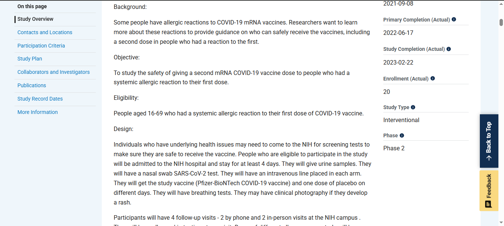
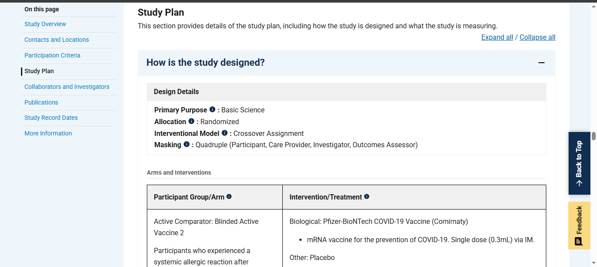
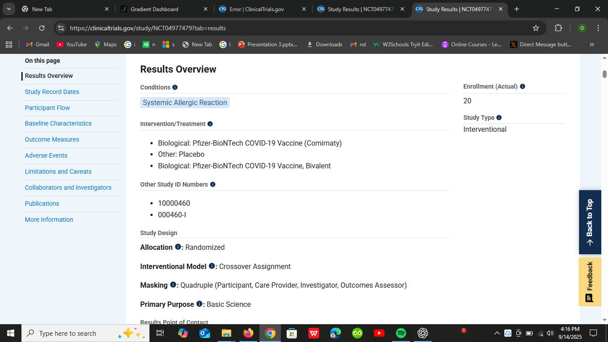

# Covid-19-vaccine-safety-report

## 📌 Objective
To evaluate the safety of administering a second dose of a COVID-19 mRNA vaccine in individuals who experienced a systemic allergic reaction to the first dose.

---

## 📖 Abstract
A sample image of the study objectives and background.  

---

## ⚙️ Methods
A sample image of the clinical review and approach.  

---

## 📊 Results
A sample image of the results from the report.  

---

## 🔗 Full Report / Webpage
For a detailed view of the full research, references, and supporting material, visit:  
[👉 View the complete study here] (https://clinicaltrials.gov/study/NCT04977479)

---

